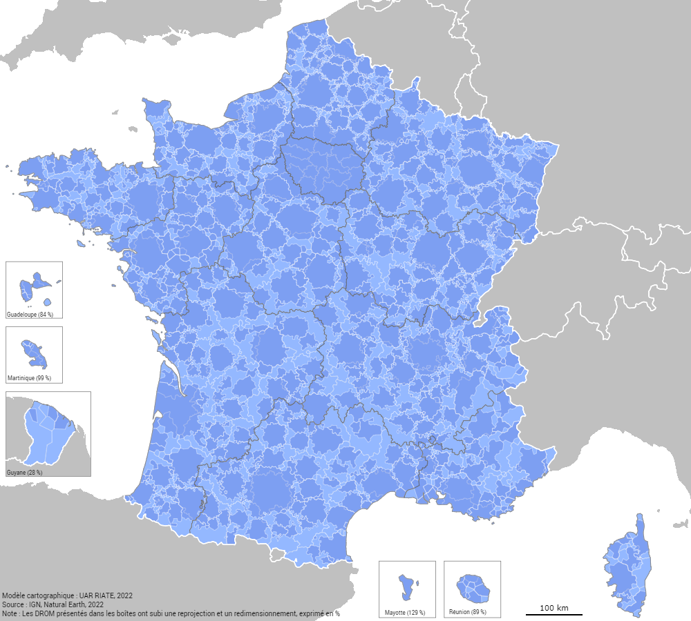

# map-templates

R programmes to build map templates for Magrit (with boxes for overseas and outermost territories), with data. 

## Template Europe

Template created with sf, giscoR, mapinsetr R libraries.
Copyright ©EuroGeographics for the administrative boundaries ; (cc) RIATE for map template.

Overseas territories (Canarias, Madeire, Açores, Guadeloupe, Martinique, Réunion, Guyane and Mayotte) are reprojected, moved and resized to appear on the main map in specific boxes. 

All the layers are in geojson format, in latitude/longitude (WGS84). To be correctly displayed, they need to be transformed in the European reference projection (ETRS89/LAEA Europe, EPSG:3035).

### NUTS2-3 (version 2020) layers attributes

- NUTS_ID : NUTS id code
- NAME_LATIN : NUTS name in local language, transliterated to Latin script
- URBN_TYPE : Urban-rural typology for NUTS3 regions (1: predominantly urban regio ; 2: intermediate region; 3 predominantly rural
- MOUNT_TYPE : Mountain typology for NUTS 3 region (1: "where more than 50 % of the surface is covered by topographic mountain areas" ; 2: "in which more than 50 % of the regional population lives in topographic mountain areas"; 
3: "where more than 50 % of the surface is covered by topographic mountain areas and where more than 50 % of the regional population lives in these mountain areas", 4: non-mountain region / other region, 0: no classification provided (e.g. in the case of NUTS 1 and NUTS 2 and non-EU countries)
- COAST_TYPE : Coastal typology for NUTS3 regions (1: coastal (on coast), 2: coastal (>= 50% of population living within 50km of the coastline), 3: non-coastal region}, 0: no classification provided (e.g. in the case of NUTS 1 and NUTS 2 regions).
- AREA_2021 : Total area in 2021 (or 2019-2020 if missing values, Eurostat table *reg_area3*)
- POP_2021 : Total population in 2021 (or 2019-2020 if missing values, Eurostat table *demo_r_pjanaggr3*)
- DENS_2021 : Population density (inh. per sq. km, POP_2021 / AREA_2021). 

### Functional Urban Areas and cities (version 2021) layers attributes

- URAU_CODE : FUA or city code
- URAU_NAME : FUA or city name
- CITY_CPTL : Is a capital ? (Y: yes)
- AREA : Total area in square kilometers
- POP : Total population
- POP_YEAR : Reference year for the total population
- DENS : Population density (inh. per sq. km, POP/AREA)

### Additional layers

This map template is built with several layout layers : world countries (main map and in boxes), world boundaries (main map and in boxes) and boxes. 

### Example with data

It is possible to enlarge the map frame if needed (if the legend overlaps with territorial units, namely).

## Template France

Template created with sf, mapinsetr, rnaturalearth, rnaturalearthdata, rmapshaper and readxl R libraries. 

Data sources : Natural Earth, IGN

### Data processing
The data processing for this map template is the following :

1. Area calculation and extract centroids from [ADMIN-EXPRESS-COG édition 2022 France entière](https://geoservices.ign.fr/adminexpress) (municipalities). 
2. Extract world countries from [Natural Earth large scale data (1:10m)](https://www.naturalearthdata.com/downloads/), with [`rnaturalearth`](https://cran.r-project.org/web/packages/rnaturalearth/index.html).
3. Simplify polygons with rmapshaper library (60 % of the points of the Natural Earth layer are deleted).
4. Create Voronoi polygons from municipal centroids, intersected with world boundaries. If a given point fall out of the French territory, a 1000m buffer is created around it, and aggregated to the French territory if the buffer area is located within a 1000 m perimeter of the French territory. This step allows to create missing little islands in the world country layer (Molène, Houëdic islands). In that way, all the French muncipalities are included in the Voronoi layer.
5. Union of the Voronoi municipal layer. The World layer is recalculated (difference) to ensure that borders are perfectly seamless with the aggregation of French Voronoi. 
6. The Voronoi municipal layer is aggregated in upper territorial divisions : *[Zones d'emploi](https://www.insee.fr/fr/information/4652957)*, *[Aires d'attractions des villes](https://www.insee.fr/fr/information/4803954)*, *[Établissements de Coopération Intercommunale](https://www.insee.fr/fr/information/2510634)*, *Départements* and *Régions*. Statistical attributes (area and population 2017) are aggegated (sum) for all these layers. 
7. *DROM* are moved and resized in predefined boxes, using the [`mapinsetr`](https://github.com/riatelab/mapinsetr) library. It is done for all territorial divisions. 

### Available layers

At the end, [6 layers](https://github.com/riatelab/map-templates/tree/main/output/france) are available with 3 attributes (total population 2017, total area and name of the territorial unit) and can be joined with French statistics : municipalites (*com.geojson*), *Établissements de Coopération Intercommunale urban areas* (*epci.geojson*) (*aav.geojson*), employment areas (*zemp.geojson*), *départements* (*dep.geojson*) and regions (*reg.geojson*). 

4 additional layers are useful to build the map template : French neighboring countries, for metropolitan area (*countries.geojson*) and oversea territories (*country_box.geojson*), their respective boundaries (*borders.geojson* and *borders_box.geojson*) boxes (*boxes.geojson*) 

All the layers are in geojson format, in latitude/longitude (WGS84). To be correctly displayed, they need to be transformed in the reference projection in France (RGF93 v1 / Lambert-93 - France - EPSG:2154).

### Example with data

